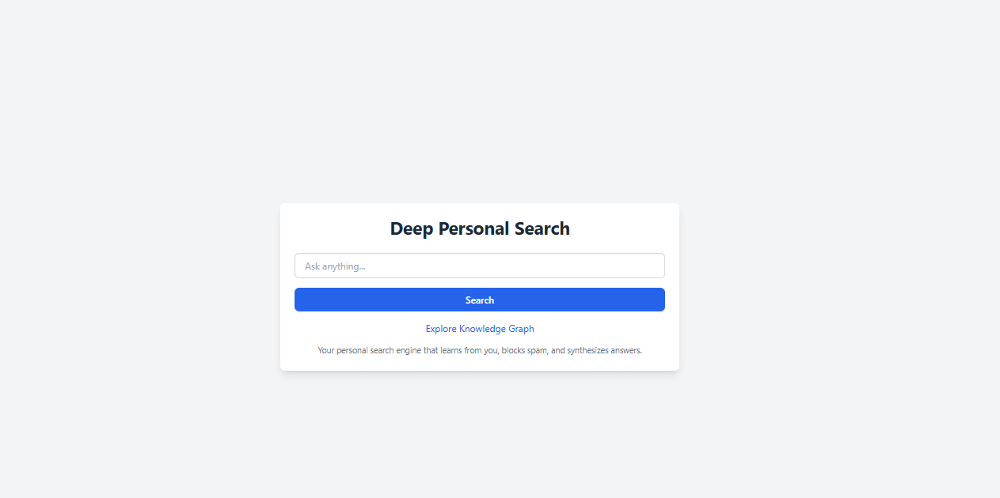
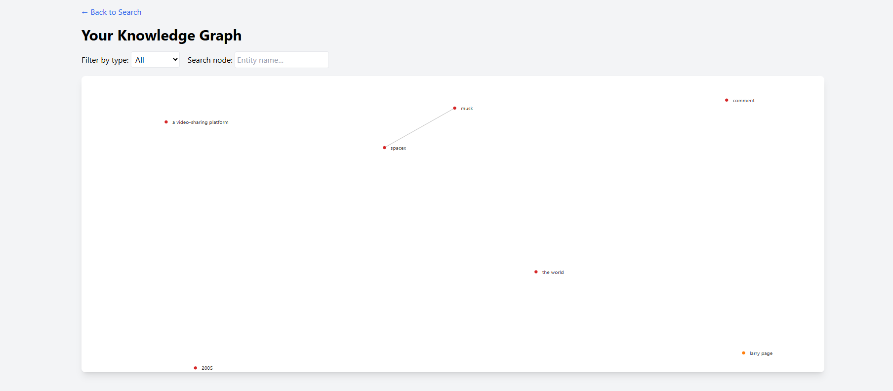

# Deep Personal Search – AI Search Engine with Personalization

[](https://python.org)
[](https://flask.palletsprojects.com)
[](https://github.com/facebookresearch/faiss)
[](https://spacy.io)
[](https://networkx.org)
[](LICENSE)

> A hybrid search engine that combines vector search, personalization, anti‑spam filtering, and a knowledge graph to deliver relevant, high‑quality results.

## Screenshots

### Dashboard


### Knowledge Graph


## Features

- 🔎 **Hybrid Search** – Combines keyword (BM25) and semantic (FAISS) retrieval.
- 👤 **Personalization** – Learns user interests from clicks and query history.
- 🧹 **Anti‑spam** – Filters out low‑quality or spammy results using heuristics and ML.
- 🧠 **Knowledge Graph** – Builds a graph of entities and relations (NetworkX) for contextual expansion.
- 📊 **Result Synthesis** – Merges multiple sources (web, local docs) into a single ranked list.
- 🖥️ **Web UI** – Flask interface to submit queries and view results with graph visualization.

---

## Tech Stack

- **Backend**: Python, Flask
- **Vector Search**: FAISS (Facebook AI Similarity Search)
- **NLP**: spaCy for entity extraction
- **Graph**: NetworkX (visualized with pyvis)
- **Ranking**: Custom scoring (TF‑IDF + embeddings + personalization)
- **Database**: SQLite for user history and preferences

---

## Why I Built This

I wanted to create a search engine that understands context, learns from user interactions, and can handle noisy data. This project showcases my ability to integrate AI techniques into a practical web application.

---

## Setup Instructions

### Prerequisites
- Python 3.8+
- At least 4GB RAM (for FAISS indexing)
- (Optional) Local LLM (e.g., Ollama) for content generation

### Clone and Install
```bash
git clone https://github.com/tayebmekati37-art/deep-personal-search.git
cd deep-personal-search
python -m venv venv
source venv/bin/activate  # or venv\Scripts\activate on Windows
pip install -r requirements.txt
python -m spacy download en_core_web_sm
